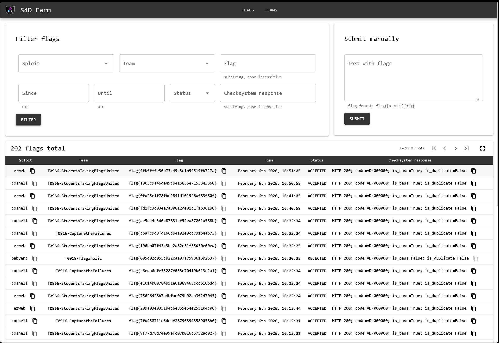

# Farmaholic

This is a fork of [S4DFarm](https://github.com/C4T-BuT-S4D/S4DFarm) that was a fork of [DestructiveFarm](https://github.com/DestructiveVoice/DestructiveFarm), 
used for flagaholic in HKCERT Final, which was rewritten by the C4T BuT S4D team over the years. (Thank you :pray: )

## Running:
- add .env file for setting a server password
- Change the [./server/app/config.py](./server/app/config.py) file to your liking
    (don't forget to change the `SERVER_PASSWORD`).
- Change external_redis password in docker-compose.yml (of you're planning to use it).
- <sub>There might be some problem with pnpm. If there is, go to **server/front** and run </sub>
```
corepack enable
corepack prepare pnpm@10.28.2 --activate
pnpm install --force
```
- `docker compose up --build -d`
- **GLHF**

Some screenshots:




